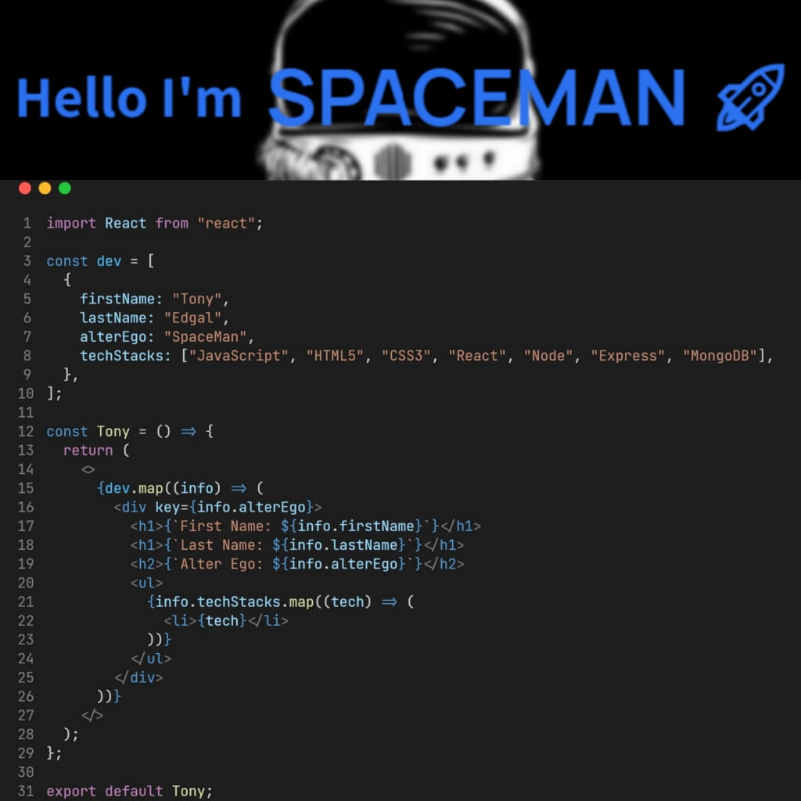

<h2>📈 Stats</h2>

    
    

    

<h2>📜About Me</h2>

I began my developer journey on December 15th, 2020 on <a href="https://www.bitdegree.org" target="_blank" rel="noopener noreferrer">Bitdegree</a> by building the <code>Space Doggos</code> website. I subsequently went on to learn HTML5, CSS3, JavaScript, React, Node and MongoDB from a number of online sources, including <a href="https://www.frontendmasters.com" target="_blank" rel="noopener noreferrer">FrontendMasters</a>, <a href="https://www.freecodecamp.org" target="_blank" rel="noopener noreferrer">FreeCodeCamp</a> and <a href="https://www.betterchalk.com" target="_blank" rel="noopener noreferrer">Betterchalk</a> (previously known as <code>Edconnect</code>) etc, just to name a few.  
Around mid 2021 I got into Technical writing to better understand key concepts in JavaScript and I published my first article on <code>JavaScript Closures</code> here on <a href="https://www.dev.to/tonyedgal" target="_blank" rel="noopener noreferrer">Dev</a>. I am open to collaborating on projects and innovative ideas. you can connect with me here:

<!---
tonyedgal/tonyedgal is a ✨ special ✨ repository because its `README.md` (this file) appears on your GitHub profile.
You can click the Preview link to take a look at your changes.
--->
